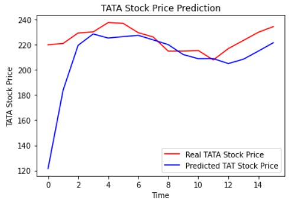

## Stock Price Prediction
Stock market prediction is the act of trying to determine the future value of a company stock or other financial instrument traded on an exchange. The successful prediction of a stock's future price could yield significant profit. The efficient-market hypothesis suggests that stock prices reflect all currently available information and any price changes that are not based on newly revealed information thus are inherently unpredictable. Others disagree and those with this viewpoint possess myriad methods and technologies which purportedly allow them to gain future price information.

As financial institutions begin to embrace artificial intelligence, machine learning is increasingly utilized to help make trading decisions. Although there is an abundance of stock data for machine learning models to train on, a high noise to signal ratio and the multitude of factors that affect stock prices are among the several reasons that predicting the market difficult. At the same time, these models don’t need to reach high levels of accuracy because even 60% accuracy can deliver solid returns. One method for predicting stock prices is using a long short-term memory neural network (LSTM) for times series forecasting.

The dataset we used in this project is NSE-TATAGLOBAL and it can be download from https://www.quandl.com/data/NSE/TATAGLOBAL-Tata-Global-Beverages-Limited




## Environment Setup

Step 1: Go to this site and download the anaconda installer for windows
+ https://docs.anaconda.com/anaconda/install/windows/

Step 2: Open anaconda termianl and create an anaconda environment
```conda create --name aipm python=3.6```

Step 3: Activate the created environment
```conda activate aipm```

Step 4: Clone the repository
```git clone https://github.com/henryyap12/stockprice.git```

Step 5: Change directory to the cloned directory
```cd stockprice```

Step 6: Install all the python requirements.txt
```pip install –r requirements.txt```


